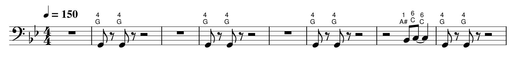

Annotate sheet music with trombone positions and letter notation
---------------------

**requirements :**  
have musescore installed or an app image

**usage :**  
support mid, mscx, mscz, musicxml, mxl, MID files  
python main.py -i [path to input file] -d [path to input dir] -o [path to output dir] -ms [path to musescore app image]  

